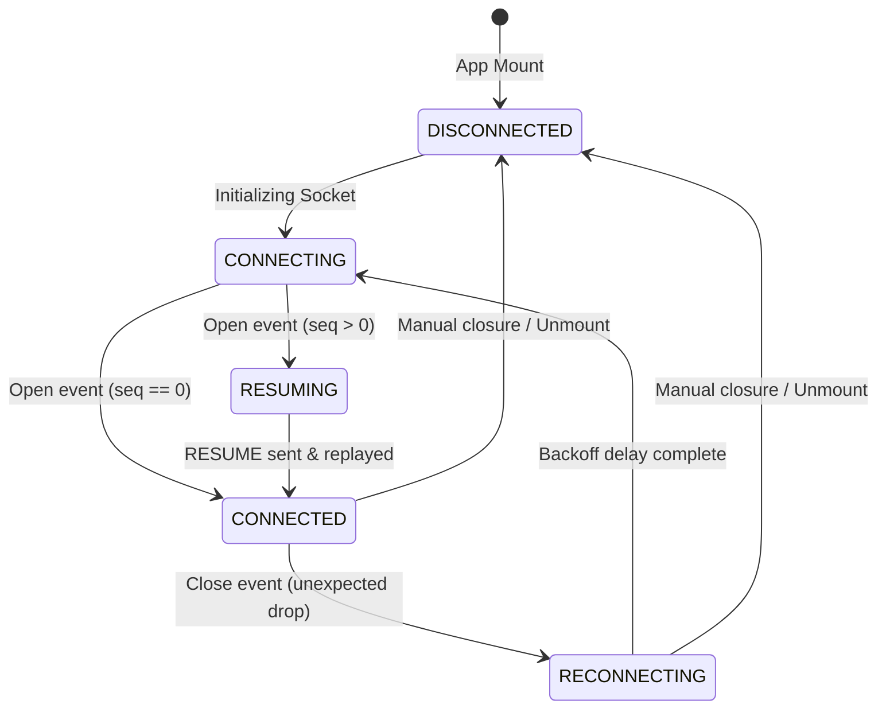

# Alchemyst Agent Console

This is the frontend client implementation for the Full Stack AI Engineer assignment. It connects to the mock AI agent backend (`agent-server`) over WebSockets and is designed to handle all chaos mode scenarios (latency spikes, out-of-order messages, duplicates, connection drops, and corrupt heartbeats) gracefully.

---

## Architectural Approach

We decoupled the **Protocol Handling Layer** from the **UI Rendering Layer** by using an ingestion pipeline. Raw WebSocket messages are processed immediately if they are out-of-band heartbeats (`PING`), while sequential messages are routed through a `ReorderingBuffer` to sort out-of-order packets and discard duplicates based on sequence numbers (`seq`). The validated, ordered message stream is then applied to a stateful React context, where agent streams are segmented into stable content blocks to prevent reflow and layout shift.

---

## State Machine Diagram

The following Mermaid diagram shows the WebSocket connection states and transitions:



---

## Running Instructions

### 1. Run the Agent Server

You can run the provided backend using Docker or locally:

**Using Docker (Recommended)**
```bash
cd agent-server
docker build -t agent-server .
# Normal mode
docker run -p 4747:4747 agent-server
# Chaos mode
docker run -p 4747:4747 agent-server --mode chaos
```

**Running Locally**
```bash
cd agent-server
npm install
npm run build
npm start
# Or for chaos mode
npm start -- --mode chaos
```

### 2. Run the Agent Console

We provided a root-level workspace `package.json` in the assignment folder to make it easy to run.

**Install Dependencies**
```bash
# Run from June-2026_FullStackAI/
npm run install:all
```

**Start Development Server**
```bash
# Run from June-2026_FullStackAI/
npm run dev
```
The application will be accessible at `http://localhost:3000`.

**Build for Production**
```bash
# Run from June-2026_FullStackAI/
npm run build
npm run start
```

---

## Directory Structure

- `src/app/`: Next.js page layouts, global styles, and setup.
- `src/components/`:
  - `ChatPanel`: Conversational feed with layout-shift-free tool cards.
  - `TimelinePanel`: Live event feed with token grouping and bidirectional link tracing.
  - `ContextInspector`: Lazy-loaded nested JSON tree rendering key diffs with a scrubber slider.
- `src/context/`: Main React context orchestrating WebSocket events and component state.
- `src/hooks/`: `useWebSocket` lifecycle hook managing retries, exponential backoffs, and heartbeat echoes.
- `src/lib/`:
  - `reordering-buffer`: Handles out-of-order sequence buffer queues and deduplication.
  - `json-diff`: Recursively computes object differences (additions, modifications, deletions).
