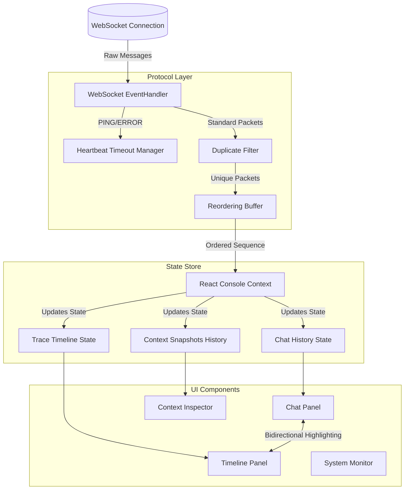
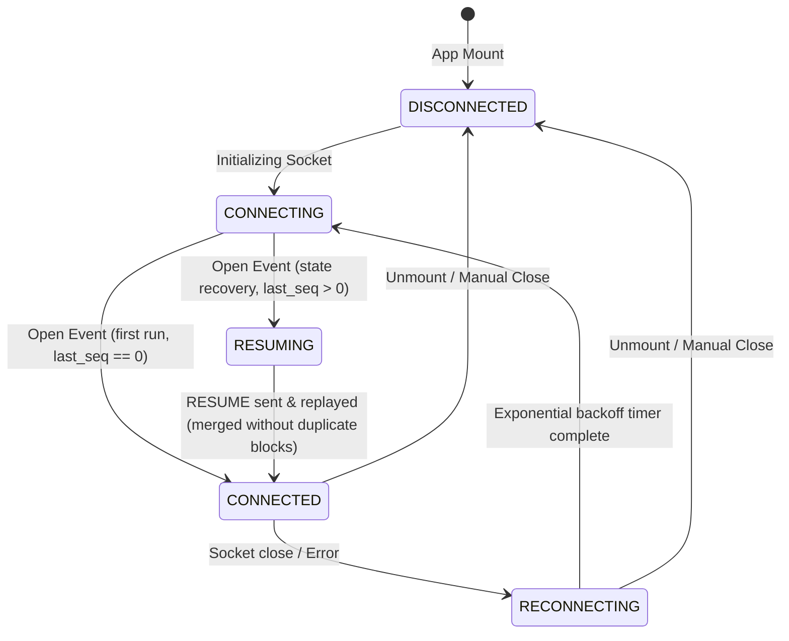

# Alchemyst Agent Console

A resilient, real-time AI Agent Console built with Next.js (App Router), TypeScript, and Vanilla CSS. It connects to the mock AI agent backend (`agent-server`) over WebSockets and is designed to handle all chaos mode scenarios (latency spikes, out-of-order messages, duplicates, connection drops, and corrupt heartbeats) gracefully.

This is a systems-focused frontend engineering implementation, built specifically to survive unreliable network conditions, out-of-order event streams, packet drops, and backend restarts without losing state, duplicating tokens, or causing UI layout shifts.

---

## Table of Contents

1. [Architectural Overview](#architectural-overview)
2. [Connection Lifecycle & State Machine](#connection-lifecycle--state-machine)
3. [Core Features & In-Depth Walkthrough](#core-features--in-depth-walkthrough)
   - [Streaming Chat with Tool Interruption](#streaming-chat-with-tool-interruption)
   - [Agent Trace Timeline & Event Grouping](#agent-trace-timeline--event-grouping)
   - [Context Inspector & Snapshots Diff Scrubber](#context-inspector--snapshots-diff-scrubber)
   - [Reconnection & Resume Protocol](#reconnection--resume-protocol)
   - [Heartbeat Heartbeat System](#heartbeat-heartbeat-system)
   - [System Monitor & Real-Time Server Verification](#system-monitor--real-time-server-verification)
4. [Distributed Systems Chaos Resilience](#distributed-systems-chaos-resilience)
   - [Reordering Buffer](#reordering-buffer)
   - [Message Deduplication](#message-deduplication)
5. [Directory Structure](#directory-structure)
6. [Quick Start & Setup Instructions](#quick-start--setup-instructions)
   - [Prerequisites](#prerequisites)
   - [Running the Backend (Agent Server)](#running-the-backend-agent-server)
   - [Running the Frontend (Agent Console)](#running-the-frontend-agent-console)
7. [Unit Testing and Linting](#unit-testing-and-linting)

---

## Architectural Overview

The Agent Console separates protocol layer management from rendering logic. Components do not read raw socket traffic; instead, incoming messages pass through a filtering and ordering pipeline before updating the centralized state.



---

## Connection Lifecycle & State Machine

The socket connection follows a robust state machine designed to automatically heal from connection dropouts, replayed messages, and latency delays:



### State Definitions:
* **DISCONNECTED**: WebSocket is closed. UI shows status badge and prompts to re-establish.
* **CONNECTING**: Socket is opening. A new connection is initialized.
* **RESUMING**: Socket is open, and client is transmitting the `RESUME` handshake with `last_seq` to recover state.
* **CONNECTED**: Protocol is active, state is synchronized, and messages flow in sequence.
* **RECONNECTING**: Connection dropped mid-stream. Chat remains readable, and exponential backoff retries launch.

---

## Core Features & In-Depth Walkthrough

### Streaming Chat with Tool Interruption

The streaming chat panel renders tokens incrementally as they arrive from the WebSocket. To handle mid-sentence tool call interruptions without layout shifts or text reflowing:

* **Discrete Content Blocks**: The agent's stream is split into a list of text blocks and tool blocks (`type: "text" | "tool"`).
* **Flicker-Free Layout freezing**: When a `TOOL_CALL` message arrives, the previous text block freezes. A tool call card mounts directly below it, displaying arguments in a mono-spaced block. Subsequent tokens are appended to a *new* text block created after the tool block.
* **Tool Status Transitions**: The tool card renders visual loader indicators for `waiting ack`, `executing`, and a green status badge for `success`.
* **Tool Ack Handshake**: The client immediately sends `TOOL_ACK` to the server within 2 seconds. When the `TOOL_RESULT` arrives, the card renders the output result in-place.

```
+------------------------------------------+
|  Agent: "Based on the Q3 report, the...  |   <-- Frozen Text Block
+------------------------------------------+
|  [Tool Call] tool::lookup_metric         |
|  Arguments: { metric: "revenue_yoy" }    |   <-- Interruption Block (Acked/Resolved)
|  Result:    { value: "23.4%" }           |
+------------------------------------------+
|  ...revenue grew 23.4% year-over-year."  |   <-- Appended Text Block (Resumed Stream)
+------------------------------------------+
```

---

### Agent Trace Timeline & Event Grouping

The trace timeline displays a live flow of all WebSocket packets. To handle high throughput (30+ events/sec) without performance bottlenecks:

* **Token Grouping**: Consecutive `TOKEN` events are batched into a single collapsible node showing `Streamed X tokens (Duration)`, avoiding rendering hundreds of individual lines.
* **Visual Indentation & Connection**: Tool calls and results are visually linked via structural connectors using relative hierarchy and visual indentation.
* **Bidirectional Tracing**: 
  * Clicking an event in the Timeline highlights the corresponding block in the Chat feed and scrolls it into view.
  * Clicking a Tool Card in the Chat redirects the active tab to the Timeline and highlights the matching `TOOL_CALL` event.
* **Timeline Filtering**: Features a toolbar to search by content or filter out specific packet types (`PING`, `PONG`, `ERROR`, `CONTEXT_SNAPSHOT`, `TOKEN_GROUP`, etc.).

---

### Context Inspector & Snapshots Diff Scrubber

Context payloads operating on the AI agent can exceed several hundred kilobytes. The context inspector is designed for high performance:

* **JSON Diff Algorithm**: Compares the current context snapshot against the previous one recursively. It identifies additions (green), removals (red), and modified values (yellow), showing inline changes (`was <oldValue>`).
* **Timeline Scrubber Slider**: A horizontal range scrubber enables the user to drag backward and forward in snapshot history to view how context variables evolved at each sequence.
* **Search Highlighting**: Includes real-time regex-escaped queries that highlight matching keys and values, automatically expanding parent JSON tree nodes.
* **Transition Cushioning**: State updates use React's `startTransition` to decouple input scrubbing from main thread rendering, keeping the console responsive even with 500KB+ JSON structures.

---

## Reconnection & Resume Protocol

If the WebSocket terminates, the console triggers a state recovery cycle:

1. **State Preservation**: The client preserves the active thread and lists of timeline events. The chat panel remains fully readable and scrollable.
2. **Backoff Retries**: Connects using exponential backoff: `Math.min(500 * Math.pow(2, attempt), 10000)`.
3. **RESUME Handshake**: Immediately upon opening the socket, the client sends a `RESUME` message:
   ```json
   {
     "type": "RESUME",
     "last_seq": 42
   }
   ```
4. **Replay Ingestion**: The server replays missed events starting from `last_seq + 1`. The client feeds these through the reordering buffer to reconstruct state gaps.
5. **Streaming Reset**: If the connection drops mid-stream, the client resets its streaming state to `false`, preventing the typing indicator from hanging if the stream is aborted.

---

## Heartbeat Heartbeat System

The server pings the client at regular intervals to maintain connection status:

* **Verbatim Response**: When a `PING` is received:
  ```json
  { "type": "PING", "seq": 15, "challenge": "abc123" }
  ```
  The client bypasses the reordering buffer and immediately echoes the exact challenge verbatim:
  ```json
  { "type": "PONG", "echo": "abc123" }
  ```
* **Corrupt Heartbeats**: Handles empty challenges (`""`) cleanly without crashes or disconnection.
* **Latency Spikes**: The client timeout watcher is set to `24000ms` (24 seconds) to ensure that server latency spikes (which can delay heartbeats for up to 8 seconds in chaos mode) do not trigger false disconnects.

---

## System Monitor & Real-Time Server Verification

The system monitor displays:
* **Metric Cards**: Total tokens, tool calls, tool results, duplicates filtered, errors, and current sequence levels.
* **Connection Health**: Live connection state (ping count, latency).
* **Server Logs Feed**: Calls the backend `/log` endpoint directly to fetch and compare client compliance events against the server's records.

---

## Distributed Systems Chaos Resilience

### Reordering Buffer

In chaos mode, packets can arrive out of order (e.g. `1, 3, 2, 5, 4`). The client uses the `ReorderingBuffer` class:

* An internal `Map<number, ServerMessage>` stores packets.
* It tracks `lastProcessedSeq`.
* When a message is added, it pushes it to the map.
* It flushes contiguous messages starting from `lastProcessedSeq + 1`. It increments `lastProcessedSeq` and returns the sorted, gapless array to the state store.

```
Incoming: [seq: 1] -> processed (lastProcessedSeq = 1)
Incoming: [seq: 3] -> buffered in Map (waiting for 2)
Incoming: [seq: 2] -> releases [seq: 2, seq: 3] -> (lastProcessedSeq = 3)
```

### Message Deduplication

* Pre-filters all incoming messages: if `seq <= lastProcessedSeq` or `buffer.has(seq)`, the packet is discarded immediately.
* Logs duplicate arrivals as `DUPLICATE_IGNORED` events in the trace timeline for maximum protocol visibility.

---

## Directory Structure

```
agent-console/
│
├── src/
│   ├── app/
│   │   ├── layout.tsx         # App layout and provider setups
│   │   ├── page.tsx           # Dashboard dashboard grid template
│   │   └── page.module.css    # Grid layout styling
│   │
│   ├── components/
│   │   ├── ChatPanel.tsx      # Main conversation block renderer
│   │   ├── TimelinePanel.tsx  # Grouped event logs timeline
│   │   ├── ContextInspector.tsx# Recursive JSON tree diff scrubber
│   │   └── SystemMonitor.tsx  # Server /log validation interface
│   │
│   ├── context/
│   │   └── ConsoleContext.tsx # Centralized console state and dispatchers
│   │
│   ├── hooks/
│   │   └── useWebSocket.ts    # Reconnection, resume, and heartbeat hook
│   │
│   ├── lib/
│   │   ├── json-diff.ts       # Object diffing engine (Added, Removed, Mod)
│   │   └── reordering-buffer.ts # Sequential gap sorter and deduplicator
│   │
│   └── types/
│       └── protocol.ts        # Client-Server message structures
│
├── package.json               # Dependencies and Next scripts
├── tsconfig.json              # Strict compiler configs
└── README.md                  # Detailed implementation documentation
```

---

## Quick Start & Setup Instructions

### Prerequisites
* **Node.js** version 20 or higher.
* **Docker** installed and running (for containerized backend).

### Running the Backend (Agent Server)

You can run the backend either locally or inside a Docker container:

**Docker Container (Recommended)**
```bash
cd June-2026_FullStackAI/agent-server

# Build Docker image
docker build -t agent-server .

# Run in Normal Mode
docker run -p 4747:4747 agent-server

# Run in Chaos Mode
docker run -p 4747:4747 agent-server --mode chaos
```

**Running Locally**
```bash
cd June-2026_FullStackAI/agent-server
npm install
npm run build
npm run dev -- --mode chaos   # Launches backend in chaos mode
```

---

### Running the Frontend (Agent Console)

Install and run the application from the root assignment directory:

```bash
cd June-2026_FullStackAI

# 1. Install all workspaces
npm run install:all

# 2. Run in development mode
npm run dev
```

Open `http://localhost:3000` in your browser.

**Build for Production**
```bash
cd June-2026_FullStackAI/agent-console
npm run build
npm run start
```

---

## Unit Testing and Linting

Run unit tests (validating `ReorderingBuffer` out-of-order/duplicate sequences and the `json-diff` object traversal):

```bash
# Run unit tests
cd June-2026_FullStackAI/agent-console
npx vitest run

# Run TypeScript compiler checks
npx tsc --noEmit

# Run Next.js Linter
npm run lint
```
